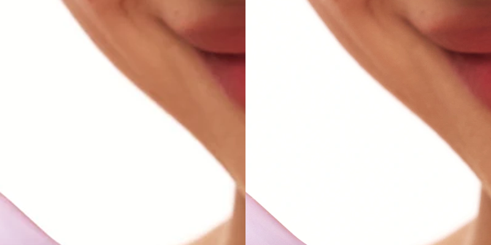
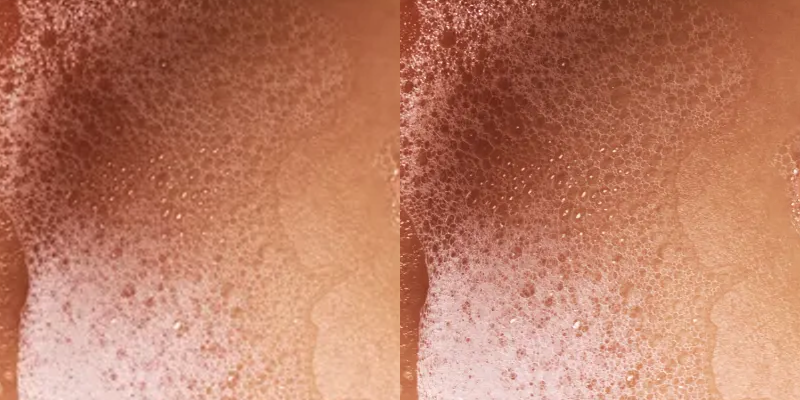
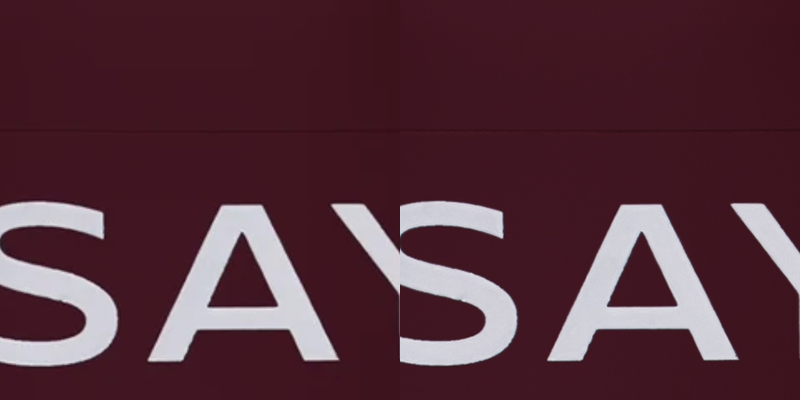

# Image Pipeline Quality — FAST FINAL

Изолированная ветка `codex/image-pipeline` от `c0d59dd09b20f3005ec119e9d808182823577cd3`. Отложенный PDP-коммит `81ed42d` в неё не входит. Production не менялся.

## Хранение и обработка

- Migration `032_media_masters_derivatives.sql`: отдельные таблицы `product_media_masters` и `product_media_derivatives`. Номер 031 оставлен за отложенной задачей PDP; зависимости от неё нет.
- Master — точные исходные байты upload в `product_media_masters.content`. Исходник не заменяется derivative и не выдаётся публичным media endpoint. EXIF учитывается при ориентации, но не попадает в публичные версии.
- Upload: JPG/PNG/WebP до 20 MiB и 25 мегапикселей, без анимации. Лимит API/Next — 28 MiB для base64/JSON. Таймаут клиента 120 секунд. Product Editor показывает индикатор обработки и ошибки/повтор; Site Editor — состояние загрузки/обработки и ошибки.
- Responsive widths: 640, 960, 1280, 1600, 2400, 3200 px. Реальная ширина ограничена исходником, upscale отсутствует. Варианты генерируются из master; для сильного zoom требуется больше исходных пикселей, также не более размера master.
- Фото: WebP quality 94, effort 4, alphaQuality 100. Изображения с фактической прозрачностью: lossless WebP. Оpaque PNG-фото не становятся lossless только из-за наличия альфа-канала. AVIF не добавлен. Настройки соответствуют [Sharp WebP](https://sharp.pixelplumbing.com/api-output/#webp) и [withoutEnlargement](https://sharp.pixelplumbing.com/api-resize/).
- Прежний URL `/api/store/v1/media/:id` сохраняется, для нового upload содержит нормализованный fallback до 1600 px по длинной стороне. Responsive версии запрашиваются с `?w=...`; браузер получает `srcset/sizes`. Карточки, thumbnail, поиск, корзина, PDP и Site Editor используют общий компонент. Новые media отложенных PDP-блоков смогут пользоваться тем же `CroppedImage` без отдельного encoder.

## Crop и повторное сохранение

Модель desktop/mobile `x/y/zoom` сохранена. Визуальный crop продолжает применяться существующим CSS к реальному размеру контейнера — сервер не придумывает его aspect ratio и не применяет crop второй раз. Crop metadata входит в ключ derivative; изменение crop создаёт новый вариант непосредственно из master, с запасом разрешения для zoom. Повторный запрос использует cache, обычный Save без изменения media не вызывает encoder. В интерактивном окне кадрирования переиспользуется большой вариант, чтобы не запускать encoder на каждом движении ползунка. Кеш ограничен 72 вариантами на изображение; master не удаляется.

## Legacy

Существующие production WebP и `/images/...` не переписаны, их URL/порядок/crop не менялись. Старая схема сохраняла только пережатую копию; для записей без подтверждённого master endpoint возвращает ровно прежние байты даже с параметрами размера/crop. Утраченную детализацию не имитируем: для улучшения такого файла нужен исходник или новая загрузка. Привязку неизвестных локальных файлов к production media автоматически не угадывали.

## Сравнение трёх реальных исходников проекта

Это сравнение старого алгоритма (2048 по длинной стороне, WebP 88) и нового на одинаковых исходниках, а не изменение production-файлов. Два исходника превышают старый upload-лимит 6 MiB: старый encoder здесь запущен отдельно для сравнения.

| Изображение / SHA-префикс исходника | Master, px | Старый алгоритм: px / bytes | Новый большой вариант: px / bytes | Визуальный вывод |
|---|---|---|---|---|
| Портрет `273c2adf684e` | 2668×3693 | 1480×2048 / 154334 | 2668×3693 / 839312 | Меньше размытия контура и фактуры кожи, без очевидных новых артефактов |
| Пена `20596d8d9315` | 3072×4096 | 1536×2048 / 260578 | 3072×4096 / 4149120 | Сохранены мелкие пузырьки; фактическая прозрачность требует более тяжёлого lossless-варианта |
| Упаковка `248c80bc7696` | 2550×3400 | 1536×2048 / 74350 | 2550×3400 / 1125114 | Более чёткие края букв и детали упаковки; прозрачность сохранена |

Сравнения: слева старый результат, растянутый до того же масштаба, справа новый; фрагменты 1:1.

## Проверки и deploy scope

- 8 backend media tests: master, EXIF/orientation, alpha, no upscale, cache/crop rebuild, legacy bytes, Save без encoder, авторизация/CSRF и идемпотентность upload.
- 4 клиентских теста: upload/validation, media paths, srcset/sizes/crop metadata.
- Дополнительный HTTP smoke: `w=640` работает, запрос master и неизвестный размер отклоняются.
- Короткий браузерный smoke реального React-компонента: desktop 1440px @2x выбирает 960px для карточки и 2400px для hero; mobile 390px @3x — 640px и 1280px. Изображения декодированы успешно.
- Backend build, frontend typecheck, storefront/Admin production builds. Для локального worktree используется `next build --webpack`: Turbopack не разрешает symlink на общую папку зависимостей вне корня worktree. Конфигурация bundler в репозитории не изменена.
- Будущий deploy: API + Admin + storefront + migration 032. Не включать отложенный PDP commit/migration 031. Дизайн, цены, stock, YCP/CDEK не менялись. Deploy не выполнялся.
